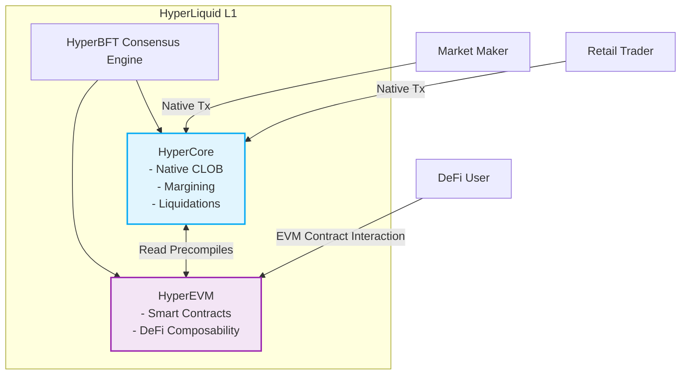

# HyperLiquid: Bridging the Gap Between CEX Performance and DEX Self-Custody

> [!NOTE]
> **Executive Summary**
> HyperLiquid is a specialized, purpose-built Layer-1 blockchain designed exclusively for high-performance cryptocurrency trading. It aims to solve the classic "blockchain trilemma" for financial markets by delivering the sub-second latency and deep liquidity of Centralized Exchanges (CEXs) while maintaining the trustless, self-custodial nature of Decentralized Exchanges (DEXs). 

This research guide explores the technical architecture, consensus mechanisms, and market microstructure of HyperLiquid. It is tailored for students with a foundational understanding of market making, order books, and blockchain mechanics.

---

## 1. The Architectural Paradigm Shift: Application-Specific Layer-1s

Most decentralized applications (dApps), such as Uniswap or dYdX (initially), are deployed as smart contracts on general-purpose Layer-1 (L1) or Layer-2 (L2) blockchains like Ethereum or Arbitrum. The fundamental limitation here is **block space contention**. Your high-frequency trading algorithm is forced to compete for computational resources with NFT mints, complex DeFi protocols, and meme-coin transfers, leading to variable latency and unpredictable gas fees.

HyperLiquid circumvents this by operating as an **app-chain**—an L1 blockchain built entirely to serve one application: an order book exchange. 

### The Dual-Layer Architecture: HyperCore and HyperEVM

HyperLiquid's architecture is divided into two integrated subsystems that share the same consensus state:

1. **HyperCore (The Financial Primitives Engine):**
   This is the native engine of the blockchain. Instead of being programmed via smart contracts, functions like the Central Limit Order Book (CLOB), perpetual contract funding rate calculations, margin accounting, and liquidations are hardcoded directly into the blockchain's state machine. Because it bypasses Virtual Machine (VM) execution overhead, HyperCore achieves deterministic, ultra-low latency execution.
   
2. **HyperEVM (The Smart Contract Layer):**
   To allow external developers to build complementary applications (e.g., money markets, yield aggregators), HyperLiquid features a fully EVM-compatible execution environment. Through special "read precompiles," smart contracts deployed on the HyperEVM can directly query HyperCore data (like live order book states) acting as low-latency "system calls" without requiring cross-network bridging.

---

## 2. Consensus & Network Engine: HyperBFT

> [!IMPORTANT]
> A trading engine is only as strong as its ability to order transactions sequentially and immutably. 

Standard Proof-of-Work (like Bitcoin) or standard Proof-of-Stake (like Ethereum) consensus algorithms produce block times ranging from 12 seconds to 10 minutes. This is entirely unacceptable for market makers who provide liquidity using quantitative algorithms.

HyperLiquid utilizes **HyperBFT**, a proprietary consensus algorithm heavily inspired by the **HotStuff protocol** (a Byzantine Fault Tolerant protocol used in modern high-performance chains).

- **Sub-Second Finality:** HyperBFT achieves median end-to-end latency of roughly **0.1 to 0.2 seconds**, processing upwards of **200,000 orders per second**.
- **Deterministic Single-Block Finality:** Unlike blockchains requiring multiple block confirmations to prevent reorganizations, any transaction included in a HyperLiquid block is instantly mathematically final.
- **Pipelining:** To increase throughput, HyperBFT utilizes pipelining to sequence blocks and process transactions concurrently, avoiding the idle waiting times inherent in older consensus designs.

---

## 3. Market Microstructure: The Fully On-Chain CLOB

The defining characteristic of early DeFi trading mechanics was the Automated Market Maker (AMM) (e.g., $x \times y = k$). AMMs were adopted because early blockchains could not handle the computational intensity of matching thousands of bids and asks per second. 

As trading evolved toward professional standards, platforms moved toward Order Book models, but many decentralized perpetual exchanges (like early dYdX or Aevo) utilize an **off-chain matching engine** paired with **on-chain settlement**. 

### The "Off-Chain Matcher" Problem
When an exchange uses an off-chain sequencer to match orders:
1. **Opaque Execution:** The central operator controls order sequencing, opening the door for internal front-running or preferential treatment to certain market makers.
2. **Censorship Risk:** The centralized sequencer acts as a single point of failure.

### HyperLiquid's Solution
HyperLiquid operates a **fully on-chain Central Limit Order Book (CLOB)**. 

- Every order cancellation, modification, and fill is broadcast to validator nodes and matched mathematically via the network consensus. 
- Matches follow strict traditional finance rules: **Price-Time Priority (FIFO)**. Better prices fill first; identical prices are filled based on exact transaction timestamp. 

> [!TIP]  
> **What this means for quant students:** By having a fully on-chain C-LOB with sub-second latency, it becomes possible to build high-frequency market-making algorithms (e.g., using Avellaneda-Stoikov models) directly on the blockchain, competing dynamically for spread capture without trusting a centralized black box.

---

## 4. Perpetual Futures and Double Margining

HyperLiquid primarily focuses on **Perpetual Futures** (perps), derivative contracts inherently requiring rigorous risk management.

Because execution happens natively on the blockchain, latency between trade submission and fill can technically witness micro-movements in oracle-provided asset prices. To protect the protocol from insolvency or unfair liquidations, HyperCore utilizes a specialized **Double Margining** mechanic.

1. **Submission Check:** When an order is mathematically submitted to the mempool, the protocol checks the wallet against required initial margin.
2. **Execution Check:** At the exact millisecond the transaction is matched by HyperBFT and ordered in the block, margin requirements are re-assessed against the live, unified L1 state. If market conditions have violated the margin thresholds between submission and execution, the order is dropped, preventing toxic fills from jeopardizing network health.

## 5. Conclusion

HyperLiquid represents the maturation of decentralized trading infrastructure. By vertically integrating the entire stack—from the L1 consensus mechanism (HyperBFT) to the trading engine (HyperCore), while preserving open developer composability (HyperEVM)—it systematically removes the technical concessions previous decentralized exchanges had to make. For developers and quantitative finance students, it offers a verifiable, hyper-optimized venue to test trading logic with the UX of a centralized entity, but the rigorous transparency of on-chain code.
